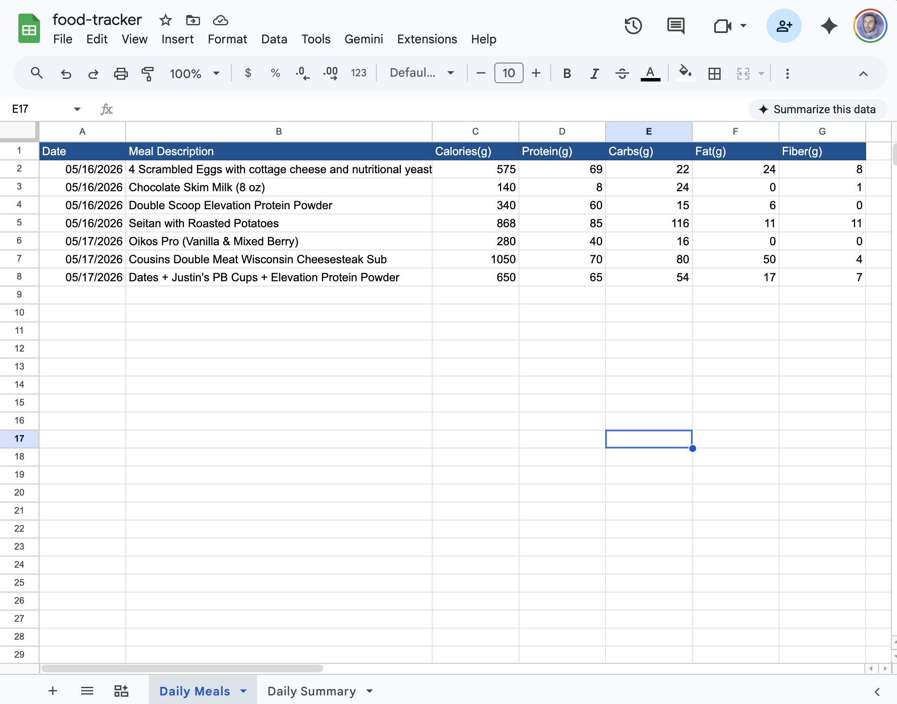
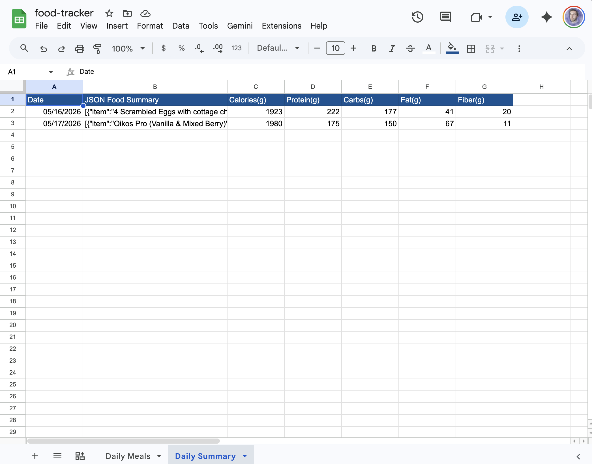
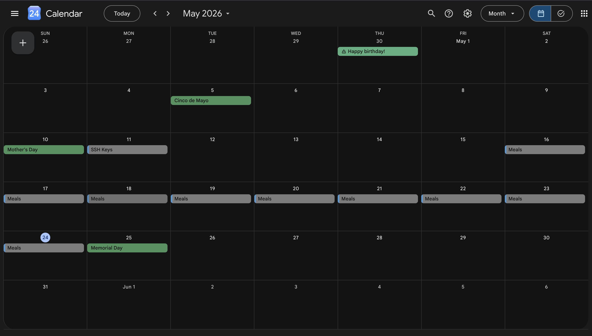
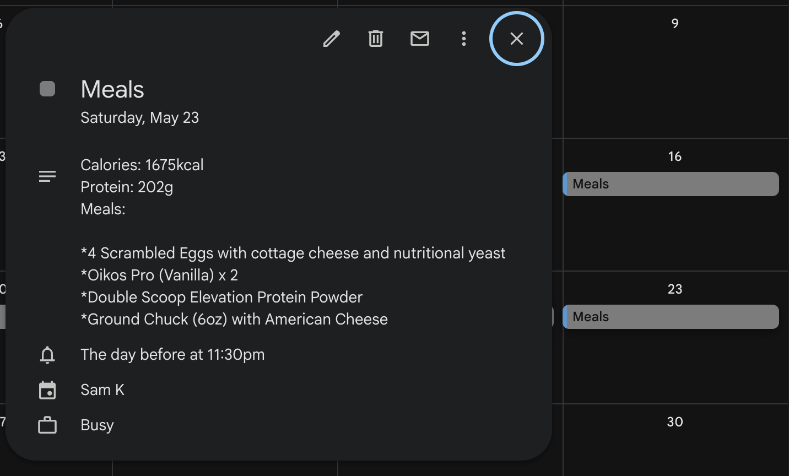

# Food Tracker Summary Apps Script

I've been tracking what I eat daily using Gemini for a while now but the context window usually fries out long before I'm able to see a full week breakdown.

To fix this I've created a workbook on Google Sheets with two sheets:

* Daily Meals - each row is a "meal" with the following data points: 
`Date	Meal Description	Calories(g)	Protein(g)	Carbs(g)	Fat(g)	Fiber(g)`

* Daily Summary - each row is a summary of everything eaten each day with the following data points:
`Date	JSON Food Summary	Calories(g)	Protein(g)	Carbs(g)	Fat(g)	Fiber(g)`

* Meals Integrated on Google Calendar

Special note: 
I'm using a built in Apps Script feature called Script Properties:

`SPREADSHEET_ID` is mapped to a specific Google Sheet via this feature to prevent leaked IDs on GitHub.
`GMAIL_EMAIL_ADDRESS` is the target Calendar's associated email address.

